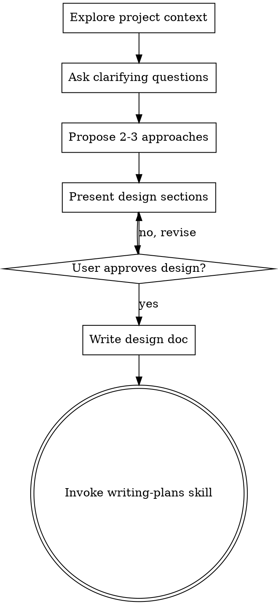

# Brainstorming Ideas Into Designs

## Overview

Help turn ideas into fully formed designs and specs through natural collaborative dialogue.

Start by understanding the current project context, then ask questions one at a time to refine the idea. Once you understand what you're building, present the design and get user approval.

<HARD-GATE>
Do NOT invoke any implementation skill, write any code, scaffold any project, or take any implementation action until you have presented a design and the user has approved it. This applies to EVERY project regardless of perceived simplicity.
</HARD-GATE>

## Anti-Pattern: "This Is Too Simple To Need A Design"

Every project goes through this process. "Simple" projects are where unexamined assumptions cause the most wasted work. The design can be short, but you MUST present it and get approval.

## Checklist

You MUST create a task for each of these items and complete them in order:

1. **Explore project context** — check files, docs, recent commits
2. **Ask clarifying questions** — one at a time, understand purpose/constraints/success criteria
3. **Propose 2-3 approaches** — with trade-offs and your recommendation
4. **Present design** — in sections scaled to their complexity, get user approval after each section
5. **Write design doc** — save to `docs/plans/YYYY-MM-DD-<topic>-design.md` and commit
6. **Transition to implementation** — invoke writing-plans skill to create implementation plan

## Process Flow

**The terminal state is invoking writing-plans.** Do NOT invoke frontend-design, mcp-builder, or any other implementation skill.

For detailed process steps (questioning technique, design presentation, documentation, key principles), see [references/detailed-process.md](references/detailed-process.md).
