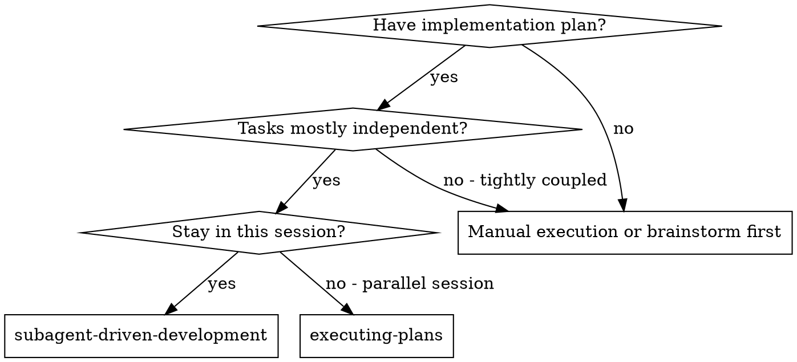
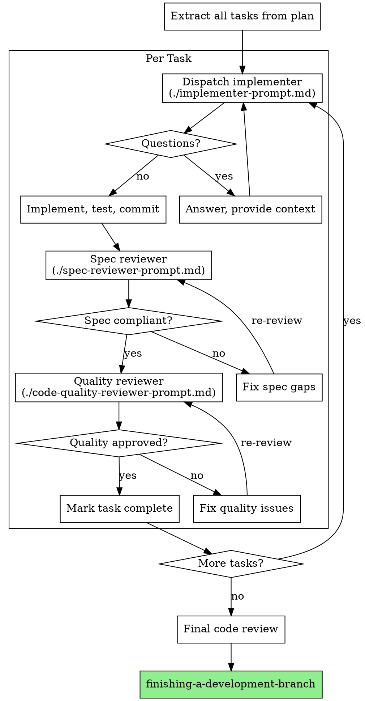

# Subagent-Driven Development

Execute plan by dispatching fresh subagent per task, with two-stage review after each: spec compliance review first, then code quality review.

**Core principle:** Fresh subagent per task + two-stage review (spec then quality) = high quality, fast iteration

## When to Use

## The Process

## Prompt Templates

- `./implementer-prompt.md` — `./spec-reviewer-prompt.md` — `./code-quality-reviewer-prompt.md`

## Red Flags

**Never:** skip reviews, proceed with unfixed issues, dispatch parallel implementers, make subagent read plan file (provide full text), start code quality review before spec compliance passes.

- Dispatch prompts missing key sections (see skill-conventions/references/dispatch-prompt-template.md for the canonical 6-section structure)

**If subagent asks questions:** Answer before proceeding.
**If reviewer finds issues:** Implementer fixes, re-review until approved.

## References

- [references/workflow-example.md](references/workflow-example.md) — full walkthrough
- [references/advantages-and-costs.md](references/advantages-and-costs.md) — comparison vs manual/executing plans

**Required skills:** using-git-worktrees, writing-plans, code-review, finishing-a-development-branch, test-driven-development
