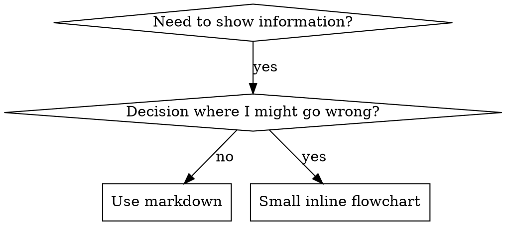

# SKILL.md Structure

## Frontmatter (YAML)

- Only two fields supported: `name` and `description`
- Max 1024 characters total
- `name`: Use letters, numbers, and hyphens only (no parentheses, special chars)
- `description`: Third-person, describes ONLY when to use (NOT what it does)
  - Start with "Use when..." to focus on triggering conditions
  - Include specific symptoms, situations, and contexts
  - **NEVER summarize the skill's process or workflow** (see CSO reference for why)
  - Keep under 500 characters if possible

```markdown
---
name: Skill-Name-With-Hyphens
description: Use when [specific triggering conditions and symptoms]
---

# Skill Name

## Overview
What is this? Core principle in 1-2 sentences.

## When to Use
[Small inline flowchart IF decision non-obvious]

Bullet list with SYMPTOMS and use cases
When NOT to use

## Core Pattern (for techniques/patterns)
Before/after code comparison

## Quick Reference
Table or bullets for scanning common operations

## Implementation
Inline code for simple patterns
Link to file for heavy reference or reusable tools

## Common Mistakes
What goes wrong + fixes

## Real-World Impact (optional)
Concrete results
```

## Directory Structure

All skills are managed by chezmoi. Edit in the chezmoi source, then `chezmoi apply`.

```
~/.local/share/chezmoi/private_dot_agents/skills/   ← edit here (source of truth)
  skill-name/
    SKILL.md              # Main reference (required)
    references/           # Deep-dive docs, examples (optional)
    bin/                  # Co-located scripts with executable_ prefix (optional)
    supporting-file.*     # Only if needed

~/.agents/skills/         ← deployed by chezmoi (real files)
~/.claude/skills/         ← symlinks to ~/.agents/skills/
~/.cursor/skills/         ← symlinks to ~/.agents/skills/
```

**Flat namespace** - all skills in one searchable namespace

**Separate files for:**
1. **Heavy reference** (100+ lines) - API docs, comprehensive syntax
2. **Reusable tools** - Scripts, utilities, templates

**Keep inline:**
- Principles and concepts
- Code patterns (< 50 lines)
- Everything else

## File Organization Examples

### Self-Contained Skill
```
defense-in-depth/
  SKILL.md    # Everything inline
```
When: All content fits, no heavy reference needed

### Skill with Reusable Tool
```
condition-based-waiting/
  SKILL.md    # Overview + patterns
  example.ts  # Working helpers to adapt
```
When: Tool is reusable code, not just narrative

### Skill with Heavy Reference
```
pptx/
  SKILL.md       # Overview + workflows
  pptxgenjs.md   # 600 lines API reference
  ooxml.md       # 500 lines XML structure
  scripts/       # Executable tools
```
When: Reference material too large for inline

## Code Examples

**One excellent example beats many mediocre ones**

Choose most relevant language:
- Testing techniques: TypeScript/JavaScript
- System debugging: Shell/Python
- Data processing: Python

**Good example:**
- Complete and runnable
- Well-commented explaining WHY
- From real scenario
- Shows pattern clearly
- Ready to adapt (not generic template)

**Don't:**
- Implement in 5+ languages
- Create fill-in-the-blank templates
- Write contrived examples

## Flowchart Usage



**Use flowcharts ONLY for:**
- Non-obvious decision points
- Process loops where you might stop too early
- "When to use A vs B" decisions

**Never use flowcharts for:**
- Reference material: Tables, lists
- Code examples: Markdown blocks
- Linear instructions: Numbered lists
- Labels without semantic meaning (step1, helper2)

See @graphviz-conventions.dot for graphviz style rules.

**Visualizing for your human partner:** Use `render-graphs.js` in this directory to render a skill's flowcharts to SVG:
```bash
./render-graphs.js ../some-skill           # Each diagram separately
./render-graphs.js ../some-skill --combine # All diagrams in one SVG
```
